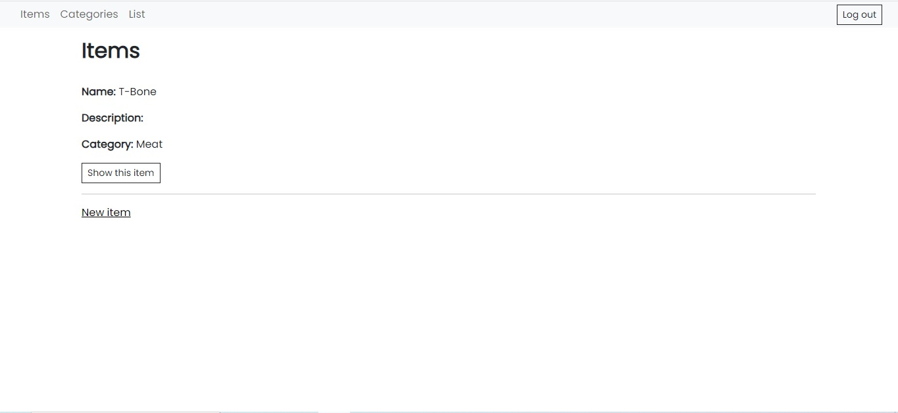

# Restaurant_Items
An application to manage and display the products you want

## Caracteristicas
With this app as an administrator you can create a single account as (Admin) providing an email and a password, you can create, edit and delete products in your _"Restaurant"_, create categories that will be displayed in the home of the application.

The user, without the need to register, can see all the products (items), either by category or together, and thus know which products are offered and their description.

## Img
|  |  |
|:---:|:---:|
| Home | Index Admin |

## Technology used
Ruby "3.1.4", Rails "7.0.5", Database: "Postgresql"

## License
[MIT](https://choosealicense.com/licenses/mit/)